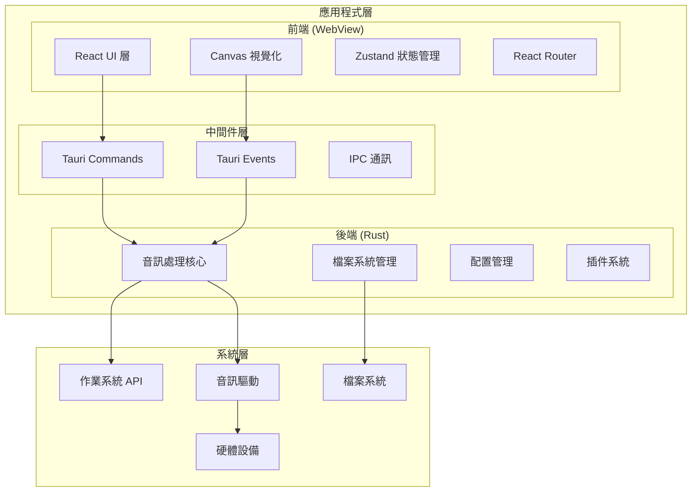
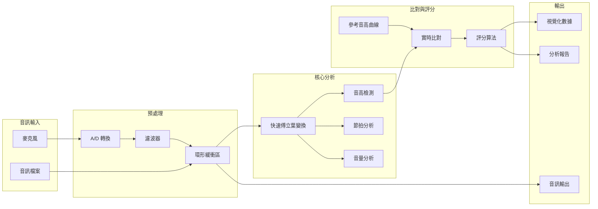
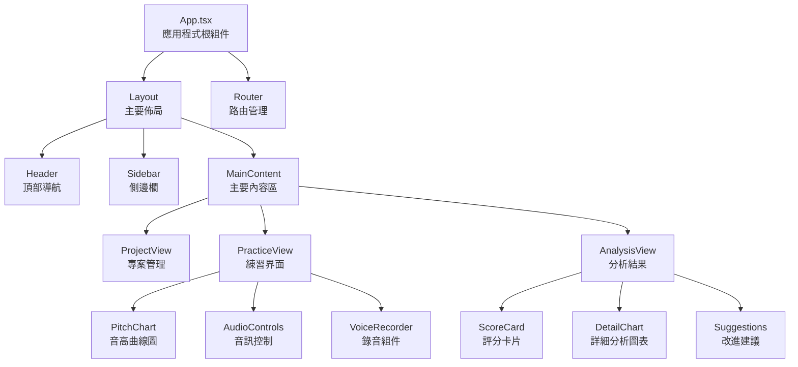
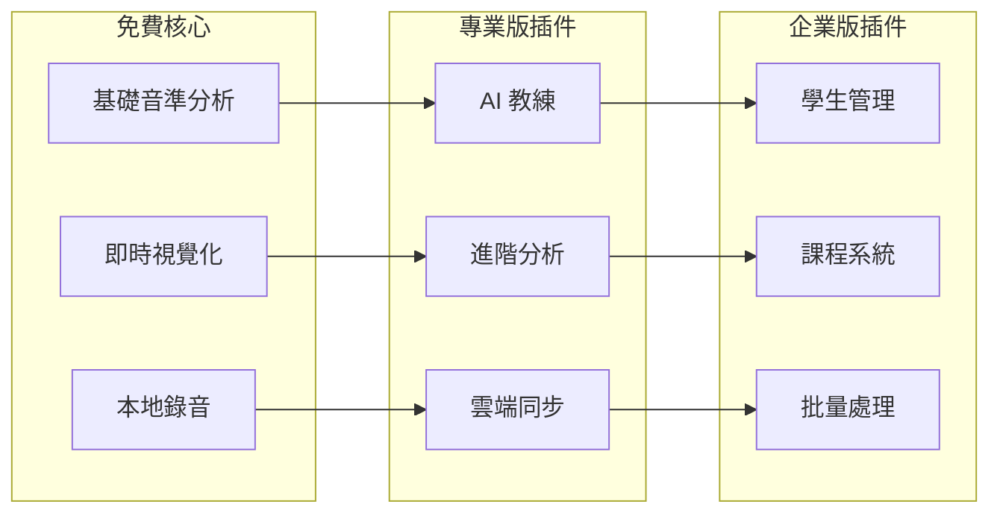

# 🏗️ VocalTrainer 技術架構文件

## 概覽

VocalTrainer 採用現代化的桌面應用架構，結合 Tauri 框架的跨平台能力與 Rust 的高效能音訊處理能力，為用戶提供專業級的歌唱訓練體驗。

## 🎯 架構設計原則

1. **效能優先**: 音訊處理延遲 <50ms，UI 渲染 60fps
2. **隱私保護**: 所有處理均在本地完成，無數據外傳
3. **模組化設計**: 支持 Open Core 商業模式的分層架構  
4. **跨平台兼容**: Windows、macOS、Linux 一致體驗
5. **可擴展性**: 支持插件系統和第三方整合

## 🏗️ 整體系統架構



## 🎵 音訊處理架構

### 音訊處理管道設計



### 關鍵技術組件

#### 1. 音高檢測引擎
```rust
// 音高檢測核心模組
pub struct PitchDetector {
    algorithm: PitchAlgorithm,
    sample_rate: f32,
    buffer_size: usize,
    window_function: WindowFunction,
}

pub enum PitchAlgorithm {
    Yin,           // 高精度，適合人聲
    McLeod,        // 快速，適合實時處理
    Autocorr,      // 基礎算法，向後兼容
}
```

#### 2. 即時音訊緩衝管理
```rust
pub struct AudioBuffer {
    ring_buffer: RingBuffer<f32>,
    read_pointer: AtomicUsize,
    write_pointer: AtomicUsize,
    sample_rate: u32,
    channels: u16,
}
```

#### 3. 音訊比對引擎
```rust
pub struct PitchComparator {
    reference_curve: Vec<PitchPoint>,
    current_position: f64,
    tolerance: f32,
    scoring_weights: ScoringWeights,
}
```

## 🖥️ 前端架構設計

### React 組件層次結構



### 狀態管理架構

```typescript
// 使用 Zustand 進行狀態管理
interface AppState {
  // 音訊狀態
  audio: {
    isRecording: boolean;
    isPlaying: boolean;
    currentTime: number;
    duration: number;
    volume: number;
  };
  
  // 專案狀態  
  project: {
    current: Project | null;
    recentProjects: Project[];
    isModified: boolean;
  };
  
  // 分析結果
  analysis: {
    pitchData: PitchPoint[];
    scoreData: ScoreData;
    isAnalyzing: boolean;
  };
  
  // UI 狀態
  ui: {
    theme: 'light' | 'dark';
    sidebarOpen: boolean;
    currentView: ViewType;
  };
}
```

## 💾 數據存儲架構

### 本地檔案組織結構

```
VocalTrainer/
├── projects/              # 用戶專案
│   ├── {project-id}/
│   │   ├── project.json   # 專案配置
│   │   ├── reference.wav  # 參考音訊
│   │   ├── recordings/    # 錄音檔案
│   │   └── analysis/      # 分析結果
├── config/               # 應用配置
│   ├── app.json         # 應用設置
│   ├── audio.json       # 音訊設置
│   └── ui.json          # 界面設置
├── cache/               # 快取檔案
│   ├── waveforms/       # 波形快取
│   └── thumbnails/      # 縮略圖
└── logs/               # 日誌檔案
```

### 數據模型設計

```typescript
// 專案數據模型
interface Project {
  id: string;
  name: string;
  created_at: string;
  updated_at: string;
  
  // 音訊檔案
  reference_audio: string;    // 原唱檔路徑
  backing_track: string;      // 伴奏檔路徑
  
  // 分析設置
  analysis_config: {
    pitch_algorithm: PitchAlgorithm;
    tempo_bpm: number;
    key_signature: string;
    time_signature: string;
  };
  
  // 練習記錄
  practice_sessions: PracticeSession[];
}

// 練習會話數據
interface PracticeSession {
  id: string;
  timestamp: string;
  duration: number;
  
  // 錄音檔案
  recording_path: string;
  
  // 分析結果
  pitch_accuracy: number;
  rhythm_accuracy: number;
  overall_score: number;
  
  // 詳細數據
  pitch_curve: PitchPoint[];
  volume_curve: VolumePoint[];
  notes: string[];
}
```

## 🔌 插件系統架構

### 插件接口設計

```rust
// 插件特徵定義
pub trait VocalTrainerPlugin: Send + Sync {
    fn name(&self) -> &str;
    fn version(&self) -> &str;
    fn description(&self) -> &str;
    
    // 插件生命週期
    fn initialize(&mut self) -> Result<(), PluginError>;
    fn shutdown(&mut self);
    
    // 音訊處理鉤子
    fn process_audio(&mut self, data: &mut AudioData) -> Result<(), PluginError>;
    
    // UI 擴展
    fn ui_components(&self) -> Vec<UIComponent>;
}
```

### 付費功能模組化



## 🚀 效能最佳化策略

### 音訊處理最佳化

1. **多執行緒處理**
   ```rust
   // 音訊處理使用專用執行緒
   let audio_thread = thread::Builder::new()
       .name("audio_processor".to_string())
       .spawn(move || {
           // 高優先權音訊處理迴圈
       });
   ```

2. **SIMD 指令集優化**
   ```rust
   // 使用 SIMD 加速 FFT 運算
   #[cfg(target_feature = "avx2")]
   fn fft_avx2(input: &[f32]) -> Vec<Complex<f32>> {
       // AVX2 最佳化實現
   }
   ```

3. **記憶體池管理**
   ```rust
   // 避免頻繁記憶體配置
   pub struct AudioBufferPool {
       available: Vec<Vec<f32>>,
       in_use: Vec<Vec<f32>>,
   }
   ```

### UI 渲染最佳化

1. **Canvas 最佳化繪製**
   ```typescript
   // 使用 RequestAnimationFrame 和髒區域重繪
   class PitchChart {
     private renderLoop() {
       requestAnimationFrame(() => {
         if (this.needsRedraw) {
           this.drawDirtyRegions();
           this.needsRedraw = false;
         }
         this.renderLoop();
       });
     }
   }
   ```

2. **虛擬化長列表**
   ```typescript
   // 大量數據列表虛擬化
   const VirtualizedList = ({ items }: { items: any[] }) => {
     const [visibleRange, setVisibleRange] = useState([0, 50]);
     // 只渲染可見項目
   };
   ```

## 🔒 安全性設計

### 數據保護策略

1. **本地加密存儲**
   ```rust
   // 敏感配置加密存儲
   pub struct SecureStorage {
       cipher: ChaCha20Poly1305,
       key: [u8; 32],
   }
   ```

2. **音訊數據保護**
   ```rust
   // 音訊流加密傳輸
   pub struct SecureAudioStream {
       encoder: AudioEncoder,
       encryption: StreamCipher,
   }
   ```

3. **插件沙盒隔離**
   ```rust
   // 插件在受限環境中執行
   pub struct PluginSandbox {
       allowed_operations: Vec<Operation>,
       resource_limits: ResourceLimits,
   }
   ```

## 📊 監控與日誌系統

### 效能監控

```rust
// 效能指標收集
pub struct PerformanceMonitor {
    audio_latency: Histogram,
    cpu_usage: Gauge,
    memory_usage: Gauge,
    render_time: Histogram,
}
```

### 錯誤處理與日誌

```rust
// 結構化日誌記錄
use tracing::{info, warn, error};

#[tracing::instrument]
pub async fn process_audio(data: AudioData) -> Result<ProcessedData, AudioError> {
    info!("開始處理音訊數據，長度: {}", data.len());
    
    match analyze_pitch(&data).await {
        Ok(result) => {
            info!("音高分析完成，檢測到 {} 個音符", result.notes.len());
            Ok(result)
        }
        Err(e) => {
            error!("音高分析失敗: {:?}", e);
            Err(AudioError::AnalysisFailed(e))
        }
    }
}
```

## 🔄 部署與更新機制

### 自動更新系統

```rust
// Tauri 內建更新機制
use tauri::updater;

pub async fn check_for_updates() -> Result<UpdateInfo, UpdateError> {
    let update = updater::check_update().await?;
    if update.is_some() {
        info!("發現新版本: {}", update.version);
    }
    Ok(update)
}
```

### 漸進式功能推出

```typescript
// 功能開關系統
interface FeatureFlags {
  aiCoach: boolean;
  cloudSync: boolean;
  vocalSeparation: boolean;
  betaFeatures: boolean;
}

const featureFlags = await loadFeatureFlags();
if (featureFlags.aiCoach) {
  // 啟用 AI 教練功能
}
```

## 📈 可擴展性設計

### 水平擴展支持

```rust
// 支持分散式音訊處理
pub trait AudioProcessor: Send + Sync {
    async fn process_batch(&self, batch: AudioBatch) -> Result<ProcessedBatch, ProcessError>;
}

// 工作池模式
pub struct AudioWorkPool {
    workers: Vec<Arc<dyn AudioProcessor>>,
    task_queue: Arc<Mutex<VecDeque<AudioTask>>>,
}
```

### 雲端整合準備

```typescript
// 雲端服務抽象層
interface CloudService {
  uploadRecording(data: AudioData): Promise<string>;
  syncProject(project: Project): Promise<void>;
  getAIAnalysis(recording: string): Promise<AIAnalysisResult>;
}

// 支援多雲端提供商
class MultiCloudService implements CloudService {
  constructor(
    private providers: CloudProvider[]
  ) {}
}
```

---

**版本**: v1.0  
**最後更新**: 2025-09-08  
**維護團隊**: VocalTrainer 開發團隊

本架構文件將隨著專案發展持續更新，確保技術決策的透明度和一致性。