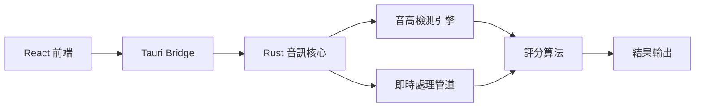

# 🎵 VocalTrainer

> 隱私優先的智慧歌唱訓練桌面應用程式

[](#)
[](#license)
[](#installation)
[](#)

VocalTrainer 是一個革命性的歌唱訓練工具，結合 AI 驅動的音準分析與完全本地化的隱私保護，為歌唱愛好者和專業人士提供科學化的訓練體驗。

## ✨ 核心特色

- 🔒 **隱私優先** - 所有音訊處理在本地完成，保護您的個人資料
- 🎯 **精準分析** - AI 驅動的音準、節拍、音量即時分析
- 📊 **視覺化反饋** - 直覺的音高曲線和即時評分顯示
- 🎼 **智慧建議** - 基於練習數據的個性化改進建議
- 🌍 **跨平台支援** - Windows、macOS、Linux 一致體驗
- 💰 **開放核心** - 免費開源基礎功能，選購進階特性

## 🚀 快速開始

### 系統需求

| 平台 | 最低需求 | 推薦配置 |
|-----|----------|----------|
| **Windows** | Windows 10+ | Windows 11 |
| **macOS** | macOS 10.15+ | macOS 12+ |
| **Linux** | Ubuntu 18.04+ | Ubuntu 22.04+ |
| **記憶體** | 4GB RAM | 8GB RAM |
| **儲存空間** | 200MB | 1GB |
| **音訊設備** | 麥克風 + 耳機/喇叭 | 專業音訊介面 |

### 安裝方式

#### 📦 下載預編譯版本 (推薦)

```bash
# Windows (透過 winget)
winget install VocalTrainer.VocalTrainer

# macOS (透過 Homebrew)
brew install --cask vocaltrainer

# Linux (透過 snap)
sudo snap install vocaltrainer
```

#### 🔧 從源碼建構

```bash
# 1. 確保已安裝 Rust (1.70+) 和 Node.js (18+)
curl --proto '=https' --tlsv1.2 -sSf https://sh.rustup.rs | sh
node --version  # 確認版本 ≥ 18

# 2. 克隆專案
git clone https://github.com/vocaltrainer/vocaltrainer.git
cd vocaltrainer

# 3. 安裝依賴
npm install

# 4. 開發模式執行
npm run tauri dev

# 5. 建構生產版本
npm run tauri build
```

## 🎤 基礎使用流程

### 1. 匯入音訊檔案
```
支援格式: MP3, WAV, FLAC
建議: 原唱檔 + 伴奏檔案組合
```

### 2. 開始練習
- 🎵 選擇伴奏模式或跟唱模式
- 🎧 戴上耳機，調整音量
- 🎤 開始演唱，觀察即時反饋

### 3. 查看分析結果
- 📊 音準準確度評分
- 📈 音高曲線比對圖
- 💡 個性化改進建議

## 🏗️ 技術架構



**技術棧:**
- **前端**: React 18 + TypeScript + TailwindCSS
- **後端**: Rust + Tauri
- **音訊處理**: cpal + rustfft + pitch-detection
- **視覺化**: Canvas API + D3.js

## 📋 功能對照表

| 功能 | 免費版 | 專業版 ($19/月) |
|-----|--------|-----------------|
| 基礎音準分析 | ✅ | ✅ |
| 即時視覺化 | ✅ | ✅ |
| 本地錄音 | ✅ | ✅ |
| 顫音分析 | ❌ | ✅ |
| AI 個性化建議 | ❌ | ✅ |
| 雲端同步 | ❌ | ✅ |
| 人聲分離 | ❌ | ✅ |

## 🛠️ 開發指南

### 開發環境設置

```bash
# 1. 安裝開發依賴
git clone https://github.com/vocaltrainer/vocaltrainer.git
cd vocaltrainer
npm install

# 2. 啟動開發伺服器
npm run dev

# 3. 執行測試
npm run test
npm run test:rust

# 4. 程式碼檢查
npm run lint
cargo clippy
```

### 專案結構

```
vocaltrainer/
├── src-tauri/           # Rust 後端程式碼
│   ├── src/
│   │   ├── main.rs     # 主程式入口
│   │   ├── audio/      # 音訊處理模組
│   │   ├── analysis/   # 分析算法
│   │   └── commands/   # Tauri 命令
├── src/                # React 前端程式碼
│   ├── components/     # React 組件
│   ├── hooks/          # 自定義 Hooks
│   ├── stores/         # Zustand 狀態管理
│   └── utils/          # 工具函數
├── docs/               # 專案文件
└── tests/              # 測試檔案
```

### 貢獻指南

我們歡迎所有形式的貢獻！

1. **🐛 回報問題**: [GitHub Issues](https://github.com/vocaltrainer/vocaltrainer/issues)
2. **💡 功能建議**: [GitHub Discussions](https://github.com/vocaltrainer/vocaltrainer/discussions)
3. **🔧 程式碼貢獻**: 請閱讀 [CONTRIBUTING.md](./CONTRIBUTING.md)
4. **📚 文件改進**: 文件和教學一樣重要

#### Pull Request 流程

```bash
# 1. Fork 專案並創建功能分支
git checkout -b feature/amazing-feature

# 2. 提交更改
git commit -m "Add amazing feature"

# 3. 推送到分支
git push origin feature/amazing-feature

# 4. 開啟 Pull Request
```

## 🌟 路線圖

- **🎯 Q1 2024**: MVP 完成，核心功能實現
- **🚀 Q2 2024**: 開源發布，社群建立  
- **💰 Q3 2024**: 商業化功能上線
- **📈 Q4 2024**: 市場推廣，用戶增長

詳細計畫請參考 [ROADMAP.md](./ROADMAP.md)

## 📚 相關文件

- 📖 [產品規格書](./VocalTrainer-ProductSpec.md)
- 🏗️ [技術架構文件](./ARCHITECTURE.md)
- 🗺️ [開發路線圖](./ROADMAP.md)
- 🤝 [貢獻指南](./CONTRIBUTING.md)
- ❓ [常見問題](./FAQ.md)

## 🆘 獲得幫助

遇到問題？我們來幫助您！

- 💬 **Discord 社群**: [加入我們的 Discord](https://discord.gg/vocaltrainer)
- 📧 **電子郵件**: support@vocaltrainer.app
- 🐛 **問題回報**: [GitHub Issues](https://github.com/vocaltrainer/vocaltrainer/issues)
- 📖 **用戶手冊**: [在線文件](https://docs.vocaltrainer.app)

## 🏆 致謝

感謝所有為這個專案做出貢獻的開發者、測試者和用戶！

### 核心貢獻者
- [@username1](https://github.com/username1) - 專案創始人
- [@username2](https://github.com/username2) - 音訊算法專家
- [@username3](https://github.com/username3) - UI/UX 設計師

### 技術致謝
- [Tauri](https://tauri.app/) - 跨平台桌面應用框架
- [cpal](https://github.com/RustAudio/cpal) - Rust 音訊庫
- [pitch-detection](https://github.com/alesgenova/pitch-detection) - 音高檢測算法
- [React](https://reactjs.org/) - 前端框架

## 📄 授權條款

本專案採用 MIT 授權條款 - 詳見 [LICENSE](./LICENSE) 檔案。

### 開源核心 + 商業插件模式

- **免費開源**: 基礎功能永久免費，原始碼完全開放
- **商業授權**: 進階功能和企業版採用商業授權
- **專利保護**: 核心算法申請專利保護，開源使用不受限制

---

<div align="center">

**用科技讓每個人都能唱出美妙的歌聲** 🎵

[](https://github.com/vocaltrainer/vocaltrainer/stargazers)
[](https://twitter.com/VocalTrainerApp)

Made with ❤️ by the VocalTrainer Team

</div>