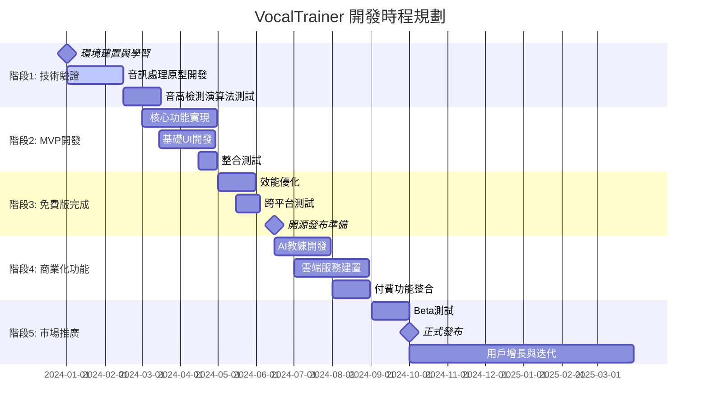
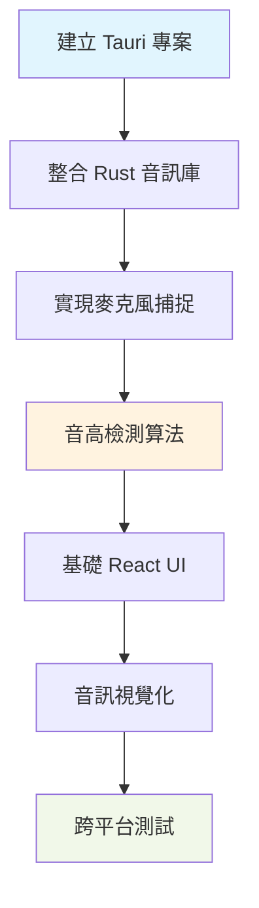
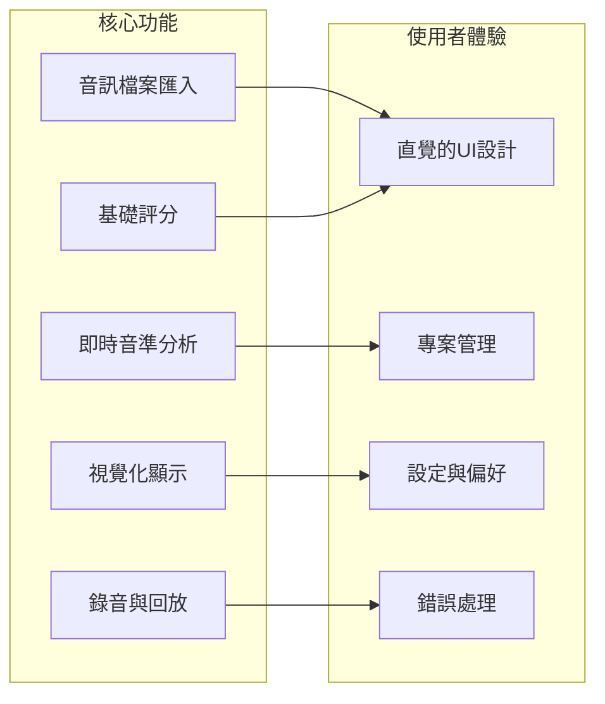
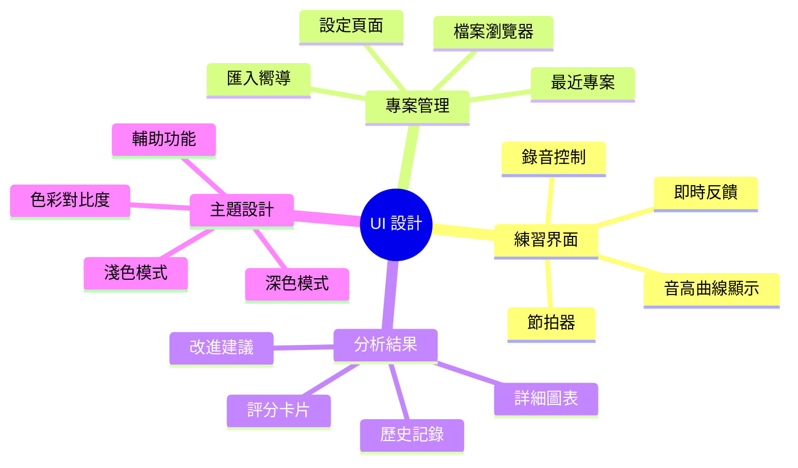
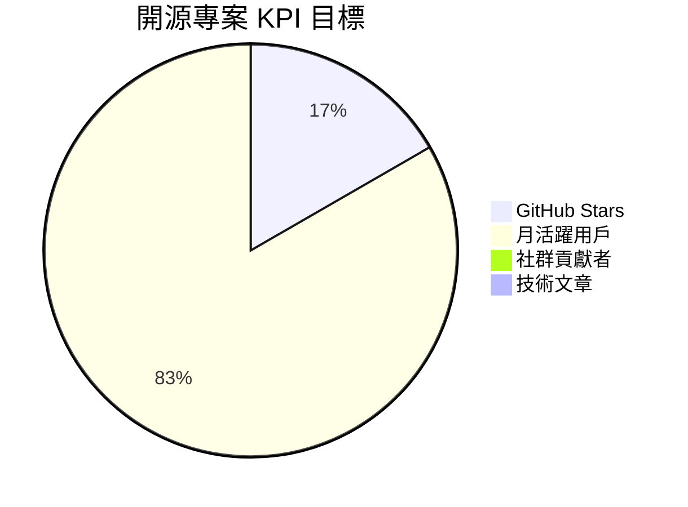
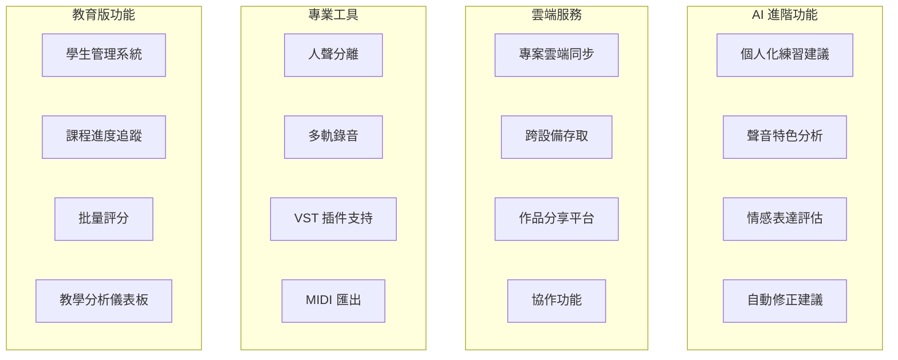
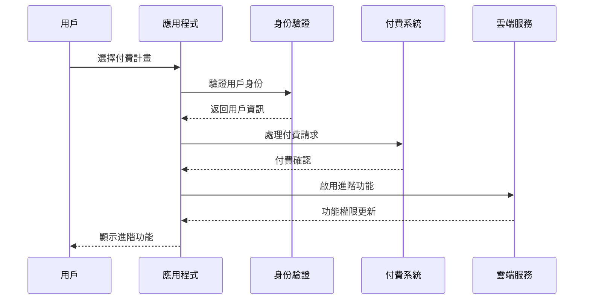
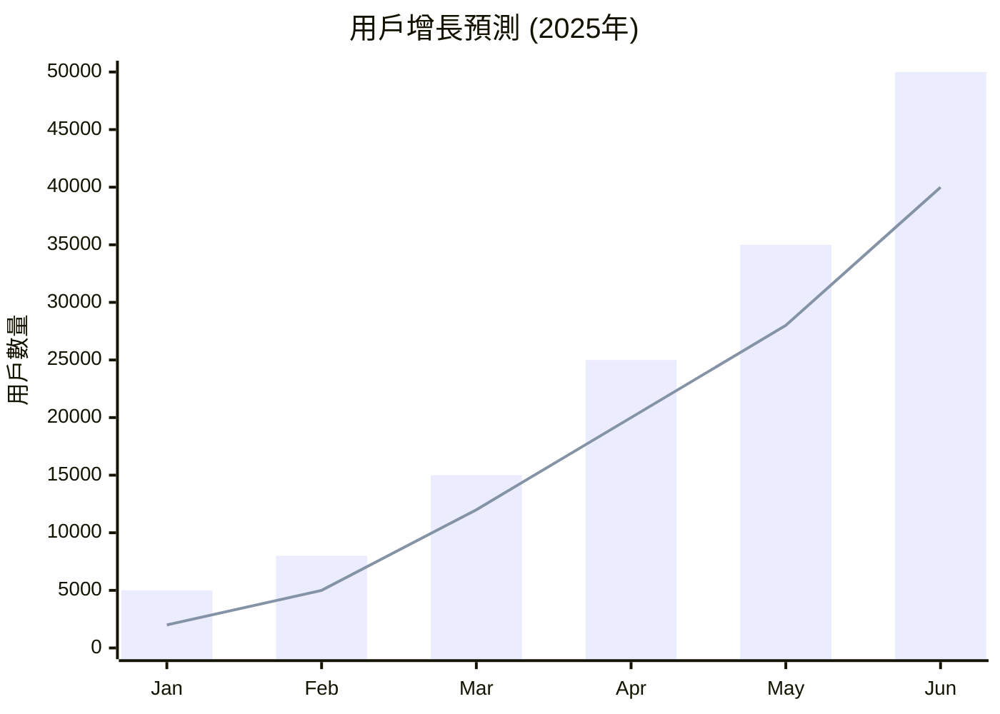
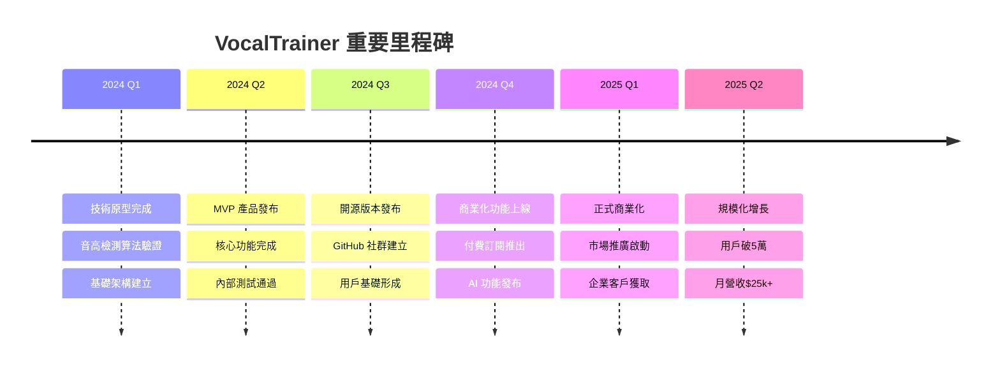
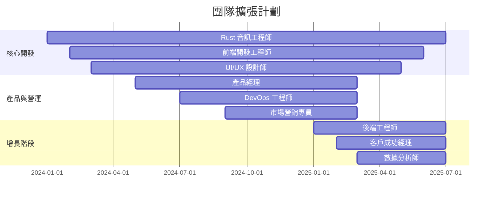

# 🗺️ VocalTrainer 開發路線圖

## 📋 專案概覽

VocalTrainer 是一個開源的智慧歌唱訓練桌面應用程式，採用 Tauri + Rust 架構，致力於為用戶提供隱私保護的本地化歌唱學習體驗。

**開發週期**: 18個月 (2024年1月 - 2025年6月)  
**商業化目標**: 第2年達到 $150萬年營收  

## 🎯 開發階段總覽



## 🚀 階段一：技術驗證 (Q1 2024)

### 目標：建立可行性的技術原型

#### 📅 時程：2024年1月1日 - 3月31日 (12週)

#### 🎯 里程碑
- [ ] **Week 1-2**: Rust + Tauri 開發環境建置
- [ ] **Week 3-4**: 基礎音訊 I/O 實現
- [ ] **Week 5-6**: 音高檢測算法整合
- [ ] **Week 7-8**: 簡單的視覺化原型
- [ ] **Week 9-10**: 跨平台編譯測試
- [ ] **Week 11-12**: 效能基準測試

#### 🔧 技術任務



**關鍵技術決策點：**
- [ ] 音高檢測算法選擇 (YIN vs McLeod vs Autocorrelation)
- [ ] 音訊緩衝區大小最佳化 (延遲 vs 準確度)
- [ ] FFT 庫選擇和效能調校
- [ ] 跨平台音訊驅動相容性測試

#### ✅ 成功指標
| 指標 | 目標值 | 測試方法 |
|-----|--------|----------|
| 音高檢測準確率 | >90% | 標準音階測試 |
| 音訊處理延遲 | <50ms | 實時處理測試 |
| 跨平台兼容性 | 100% | Windows/macOS/Linux |
| 記憶體使用量 | <200MB | 持續運行測試 |

---

## 🎵 階段二：MVP 開發 (Q2 2024)

### 目標：完整的核心功能產品

#### 📅 時程：2024年4月1日 - 6月30日 (13週)

#### 🎯 功能里程碑



#### 📋 詳細任務清單

**音訊處理核心 (4週)**
- [ ] 完善音高檢測引擎
- [ ] 實現音訊檔案解碼 (MP3, WAV, FLAC)
- [ ] 節拍檢測和時間對齊
- [ ] 音量和動態範圍分析
- [ ] 評分算法設計和實現

**前端界面開發 (3週)**
- [ ] React 組件架構設計
- [ ] 音高曲線 Canvas 繪製
- [ ] 音訊控制界面 (播放/暫停/快轉)
- [ ] 錄音界面和狀態管理
- [ ] 響應式設計和主題支持

**專案管理系統 (2週)**
- [ ] 專案檔案格式設計
- [ ] 本地檔案系統整合
- [ ] 匯入/匯出功能
- [ ] 最近專案和收藏功能

**整合測試與優化 (2週)**
- [ ] 端到端功能測試
- [ ] 效能瓶頸識別和優化
- [ ] 使用者體驗測試
- [ ] Bug 修復和穩定性改善

**打包和分發準備 (2週)**
- [ ] 跨平台編譯腳本
- [ ] 安裝包製作
- [ ] 自動更新機制
- [ ] 錯誤報告系統

#### 🎨 UI/UX 設計重點



---

## 🌟 階段三：開源版本發布 (Q3 2024)

### 目標：建立開源社群和品牌認知

#### 📅 時程：2024年7月1日 - 9月30日 (13週)

#### 🎯 開源策略里程碑

**技術完善 (4週)**
- [ ] 程式碼品質審查和重構
- [ ] API 文件自動生成
- [ ] 單元測試覆蓋率 >80%
- [ ] 效能基準測試套件

**社群建設 (4週)**
- [ ] GitHub 專案建立和README
- [ ] 貢獻者指南 (CONTRIBUTING.md)
- [ ] 問題模板和PR模板
- [ ] 持續整合 (GitHub Actions)

**文件和教學 (3週)**
- [ ] 用戶使用手冊
- [ ] 開發者API文件
- [ ] 視頻教學製作
- [ ] 社群論壇建立

**發布準備 (2週)**
- [ ] 版本號規範和發布流程
- [ ] 多語言支持 (中文/英文)
- [ ] 社群媒體宣傳素材
- [ ] 科技媒體聯繫

#### 📊 開源成功指標



| KPI | 目標 | 追蹤方式 |
|-----|------|----------|
| GitHub Stars | 1,000 | GitHub Insights |
| 月活躍用戶 | 5,000 | Telemetry (可選) |
| 社群貢獻者 | 50 | GitHub Contributors |
| 技術文章提及 | 10+ | Google Alerts |
| Discord 社群 | 500+ | 社群管理 |

---

## 💰 階段四：商業化功能開發 (Q4 2024)

### 目標：構建可持續的收益模式

#### 📅 時程：2024年10月1日 - 12月31日 (13週)

#### 🎯 付費功能開發



#### 📋 開發任務分解

**AI 教練系統 (4週)**
- [ ] 機器學習模型訓練基礎設施
- [ ] 個人化推薦算法
- [ ] 練習數據分析引擎
- [ ] 智慧建議生成系統

**雲端基礎設施 (4週)**
- [ ] 用戶帳號和身份驗證系統
- [ ] 檔案同步服務 (AWS S3/Azure)
- [ ] 即時通訊和協作
- [ ] 付費訂閱系統整合

**進階音訊處理 (3週)**
- [ ] Spleeter 人聲分離整合
- [ ] 多軌音訊編輯器
- [ ] VST 插件載入框架
- [ ] 高品質音訊匯出

**企業功能開發 (2週)**
- [ ] 多用戶管理界面
- [ ] 角色權限系統
- [ ] 批量操作工具
- [ ] 數據分析和報告

#### 💳 付費系統架構



---

## 📈 階段五：市場推廣與增長 (2025 Q1-Q2)

### 目標：建立市場地位和用戶基礎

#### 📅 時程：2025年1月1日 - 6月30日 (26週)

#### 🎯 市場策略里程碑

**產品完善期 (8週)**
- [ ] Beta 測試計畫 (1000名用戶)
- [ ] 用戶反饋收集和產品迭代
- [ ] 效能和穩定性最佳化
- [ ] 多語言本地化 (日文、韓文)

**市場推廣期 (12週)**
- [ ] 科技媒體發布和評測
- [ ] 音樂教育展會參與
- [ ] KOL 和音樂教師合作
- [ ] 社群媒體營銷活動

**用戶增長期 (6週)**
- [ ] 推薦獎勵計畫
- [ ] 教育機構合作夥伴計畫
- [ ] 功能更新和用戶留存
- [ ] 客戶成功和支持系統

#### 📊 增長目標和 KPI



**年度目標 (2025年)**
| 指標 | Q1目標 | Q2目標 | 全年目標 |
|-----|--------|--------|----------|
| 總用戶數 | 15,000 | 50,000 | 100,000 |
| 付費用戶 | 500 | 2,000 | 5,000 |
| 月營收 (USD) | $8,000 | $25,000 | $50,000 |
| 用戶留存率 | 60% | 70% | 75% |
| NPS 評分 | 40+ | 50+ | 60+ |

---

## 🚨 風險管理與應急計畫

### 技術風險

```mermaid
mindmap
  root((風險管控))
    技術風險
      音訊延遲問題
        [應對方案] 多執行緒優化
        [應對方案] 硬體加速
      跨平台相容性
        [應對方案] 廣泛設備測試
        [應對方案] 社群回饋機制
      競品技術領先
        [應對方案] 持續創新
        [應對方案] 專利佈局
    市場風險
      競爭加劇
        [應對方案] 差異化定位
        [應對方案] 快速迭代
      用戶接受度
        [應對方案] 用戶教育
        [應對方案] 免費試用
    營運風險
      人才招聘
        [應對方案] 遠程協作
        [應對方案] 股權激勵
      資金短缺
        [應對方案] 逐步增長
        [應對方案] 投資人引入
```

### 應急預案

**技術應急計畫**
- 📋 **延遲問題**: 降級到較低精度模式，保證基本可用性
- 📋 **相容性問題**: 提供舊版本回退機制
- 📋 **效能瓶頸**: 雲端輔助計算作為備選方案

**市場應急計畫**
- 📋 **增長緩慢**: 調整定價策略，增加免費功能
- 📋 **競品衝擊**: 加快差異化功能開發
- 📋 **負面評價**: 快速響應和產品改進

---

## 📅 重要里程碑時間線



---

## 📚 資源需求評估

### 人力資源規劃



### 預算分配

| 項目類別 | 2024年預算 | 2025年預算 | 占比 |
|----------|------------|------------|------|
| 人力成本 | $200,000 | $400,000 | 60% |
| 技術基礎設施 | $50,000 | $100,000 | 12% |
| 市場營銷 | $80,000 | $150,000 | 18% |
| 法務和合規 | $20,000 | $40,000 | 5% |
| 其他營運成本 | $30,000 | $60,000 | 5% |

---

**路線圖版本**: v1.0  
**最後更新**: 2025-09-08  
**負責人**: VocalTrainer 產品團隊

> 📝 **備註**: 本路線圖為動態文件，將根據市場反饋、技術發展和資源狀況定期調整更新。所有時程和里程碑僅供參考，實際執行可能因各種因素而有所變動。