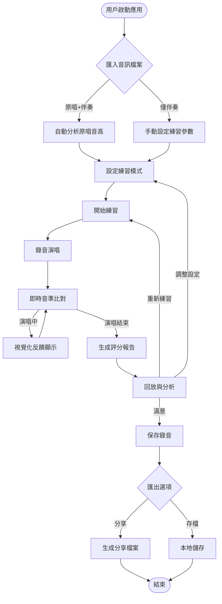
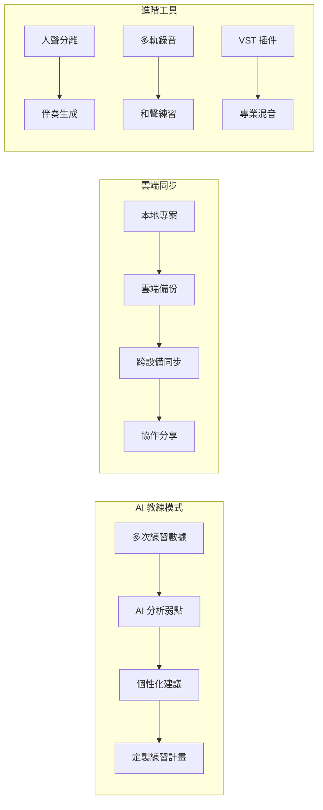
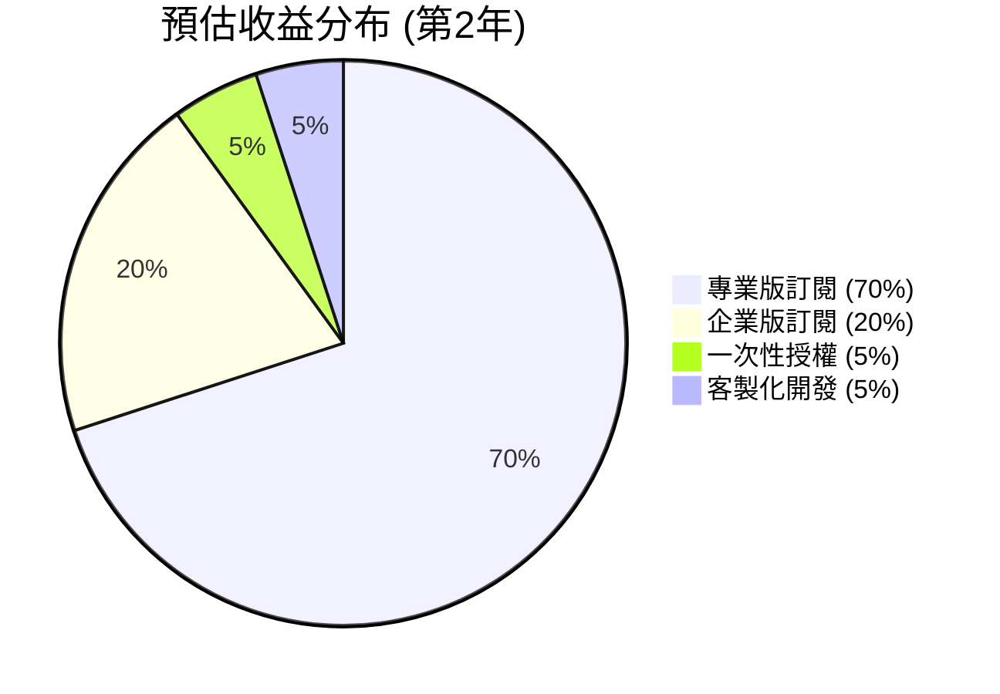
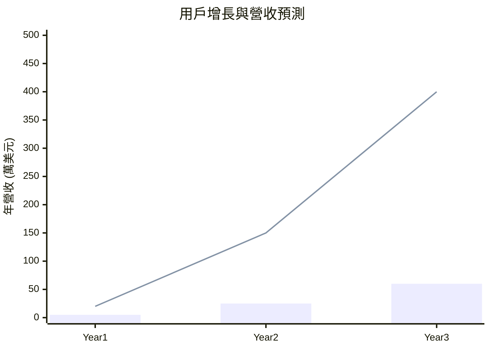

# 🎵 VocalTrainer - 智慧歌唱訓練平台產品規格書

## 🎯 產品願景

**使命：** 讓每個人都能在隱私安全的環境中，透過科學化的方式提升歌唱技巧

**核心價值主張：**
- 🔒 **完全本地化** - 所有音訊處理和個人資料保存在用戶設備上
- 🎼 **專業級分析** - AI 驅動的音準、節拍、情感表達分析
- 📈 **個性化訓練** - 基於表現數據的智慧練習建議
- 💰 **開放核心** - 免費開源基礎功能，付費進階特性

## 🏗️ 系統架構設計

```mermaid
graph TB
    subgraph "桌面應用程式 (Tauri)"
        subgraph "前端層 (WebView)"
            UI[React + TypeScript UI]
            Canvas[Canvas 即時視覺化]
            State[Zustand 狀態管理]
        end
        
        subgraph "後端層 (Rust)"
            API[Tauri Commands API]
            Core[音訊處理核心]
            Storage[本地檔案管理]
        end
    end
    
    subgraph "音訊處理管道"
        Input[麥克風輸入]
        Processing[即時音準分析]
        Comparison[音高比對引擎]
        Scoring[評分算法]
    end
    
    subgraph "檔案系統"
        Audio[音訊檔案<br/>(.mp3/.wav)]
        Projects[專案檔案<br/>(.json)]
        Records[錄音檔案]
        Reports[分析報告]
    end
    
    subgraph "開源核心庫"
        PitchLib[pitch-detection]
        FFTLib[rustfft] 
        AudioLib[cpal/rodio]
    end
    
    UI --> API
    Canvas --> API
    API --> Core
    Core --> Processing
    Core --> Storage
    Processing --> Comparison
    Comparison --> Scoring
    Storage --> Audio
    Storage --> Projects
    Storage --> Records
    Storage --> Reports
    Core --> PitchLib
    Core --> FFTLib
    Core --> AudioLib
    Input --> Processing
```

## 👤 用戶體驗流程設計

### 核心使用流程


### 進階功能流程 (付費版)


## 💰 商業模式與功能分層

### Freemium + Open Core 策略

```mermaid
pyramid
    title VocalTrainer 功能分層架構
    
    "企業教師版<br/>$49/月<br/>• 學生管理系統<br/>• 課程計畫工具<br/>• 教學分析儀表板" : 5
    
    "專業版<br/>$19/月 或 $199/年<br/>• AI 虛擬教練<br/>• 雲端同步<br/>• 人聲分離<br/>• 進階分析" : 25
    
    "免費版 (開源核心)<br/>• 基礎音準分析<br/>• 即時視覺化<br/>• 本地錄音<br/>• 社群支援" : 70
```

### 功能對比表

| 功能類別 | 免費版 (開源) | 專業版 ($19/月) | 企業版 ($49/月) |
|---------|------------|---------------|---------------|
| **核心功能** | | | |
| 音準分析與比對 | ✅ 基礎版 | ✅ 進階版 | ✅ 進階版 |
| 即時視覺化顯示 | ✅ | ✅ | ✅ |
| 本地錄音與回放 | ✅ | ✅ | ✅ |
| 基礎評分報告 | ✅ | ✅ | ✅ |
| **進階分析** | | | |
| 顫音與氣息分析 | ❌ | ✅ | ✅ |
| 情感表達分析 | ❌ | ✅ | ✅ |
| 個人化練習建議 | ❌ | ✅ AI 驅動 | ✅ AI 驅動 |
| **工具與整合** | | | |
| 人聲分離工具 | ❌ | ✅ | ✅ |
| VST 插件支援 | ❌ | ✅ | ✅ |
| 多軌錄音 | ❌ | ✅ | ✅ |
| **雲端服務** | | | |
| 雲端同步與備份 | ❌ | ✅ 無限容量 | ✅ 無限容量 |
| 跨設備存取 | ❌ | ✅ | ✅ |
| 作品分享平台 | ❌ | ✅ | ✅ |
| **教育功能** | | | |
| 學生管理系統 | ❌ | ❌ | ✅ |
| 課程進度追蹤 | ❌ | ❌ | ✅ |
| 批量作業批改 | ❌ | ❌ | ✅ |

### 收益預估模型



**目標用戶群與定價邏輯:**
- 🎵 **個人愛好者** (免費版) → 建立品牌認知與社群
- 🎤 **認真學習者** (專業版 $19/月) → 主要營收來源
- 🏫 **音樂教師** (企業版 $49/月) → 高價值客戶
- 🏢 **音樂學校** (客製化) → 大客戶合約

## 🎯 產品差異化優勢

### 與現有競品對比

| 特性 | VocalTrainer | 傳統KTV應用 | 線上歌唱課程 |
|-----|-------------|-----------|------------|
| **隱私保護** | ✅ 完全本地化 | ❌ 雲端處理 | ❌ 需要上傳 |
| **音準分析精度** | ✅ AI音高算法 | ⚠️ 基礎比對 | ❌ 人工評估 |
| **個人化學習** | ✅ 數據驅動建議 | ❌ 固定模式 | ⚠️ 通用課程 |
| **成本效益** | ✅ 一次購買 | ⚠️ 持續消費 | ❌ 高額學費 |
| **專業程度** | ✅ 技術量化分析 | ❌ 娛樂導向 | ✅ 專業指導 |

## 📊 市場機會與預期成果

### 目標市場規模
- 🌍 **全球歌唱訓練市場**: $12.5億美元 (2024年)
- 🎯 **桌面音樂軟體市場**: $3.2億美元 (年增長8%)
- 📱 **音樂學習應用用戶**: 1.2億活躍用戶

### 3年發展預期


**Year 1**: 建立技術基礎，開源社群形成  
**Year 2**: 商業化功能推出，付費用戶快速增長  
**Year 3**: 市場成熟，企業客戶擴張

## 🚀 立即行動計畫

### 第一步：技術驗證 (未來4週)
1. **建立 Rust + Tauri 基礎專案**
2. **實現簡單的音高檢測功能**
3. **測試麥克風音訊捕捉延遲**
4. **評估現有開源音訊庫的適用性**

### 成功指標
- ✅ 音高檢測準確率 >90% (標準音階)
- ✅ 音訊處理延遲 <50ms
- ✅ 跨平台 (Windows/macOS/Linux) 基本運行
- ✅ 開發環境完整建置

---

**總結**: VocalTrainer 將以"隱私優先的智慧歌唱訓練平台"為定位，通過開源核心建立技術信任，透過 AI 驅動的進階功能創造商業價值，最終成為個人歌唱學習領域的領導品牌。

**文件版本**: v1.0  
**最後更新**: 2025-09-08  
**負責人**: 專案團隊